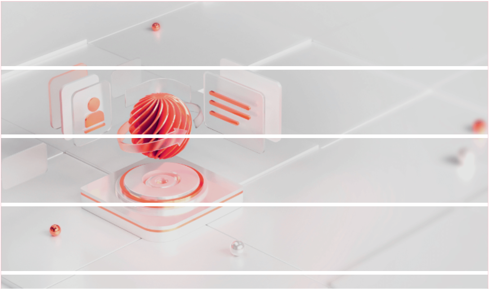

# image-to-sections 🖼️

> 📖 **[中文版本](README.md)** | 🌟 **Lightweight Front-end Image Processing Library**

A lightweight, efficient, and easy-to-use front-end image processing library focused on image slicing, thumbnail generation, Canvas conversion, and file export. Zero extra dependencies, compatible with all modern browsers, supports direct npm import.

## 📋 Table of Contents

* [Features](#-features)
* [Feature Preview](#-feature-preview)
* [Installation](#-installation)
* [Usage](#-usage)
* [API Details](#-api-details)
* [Usage Examples](#-usage-examples)
* [Browser Compatibility](#-browser-compatibility)
* [License](#-license)

## ✨ Features

Focused on core front-end image processing needs, with simple and understandable APIs, ready to use out of the box, no complex configuration, lightweight, no project redundancy.

* 🖌️ Image Slicing: Supports horizontal and vertical cutting, configurable size, zoom option, suitable for large image splitting
* 🔍 Thumbnail Generation: Proportional scaling, custom width/height, suitable for various display scenarios
* 🎨 Canvas Conversion: Image and Canvas mutual conversion, supports slicing, Blob/File export, suitable for drawing/upload scenarios

### 📸 Feature Preview

Core Capabilities: Large image slicing (horizontal/vertical), thumbnail generation, Canvas format conversion

Example: Original Image | Horizontal Slice Preview | Vertical Slice Preview

<div style="display: flex; justify-content: space-around; ">
  
  
  
</div>

## 📦 Installation

Supports npm, yarn installation, on-demand import to reduce bundle size, suitable for front-end engineering projects.

```bash
# npm (recommended)
npm install image-to-sections --save

# yarn
yarn add image-to-sections
```

## 🔧 Usage

Supports full import and on-demand import. On-demand import reduces unnecessary code bundling, recommended for production.

### Full Import

```javascript
import imageToSection from 'image-to-sections'
```

### On-Demand Import (Recommended)

```javascript
import {
    getBigImageSectionFiles, // Large image slicing (File output, core feature)
    imageFileToThumbFile, // Generate thumbnail (File)
    imageToCanvas, // Image to Canvas
    getImageCanvasSections, // Canvas slice array
    getImageCanvasSectionsH, // Canvas horizontal slicing (simplified)
    getImageCanvasSectionsV, // Canvas vertical slicing (simplified)
    canvasToBlob, // Canvas to Blob (for upload/download)
    canvasToImageFile // Canvas to ImageFile (for form upload)
} from 'image-to-sections'
```

## 📚 API Details

All APIs provide clear parameter descriptions and usage scenarios, no need for additional documentation, refer directly to the following descriptions.

### 1. getBigImageSectionFiles(imageFile, options)

**Core Feature**: Slice a large image File object and return an array of sliced Files (most commonly used).

```javascript
/**
 * @description Get sliced Files from a large image File: [file, file, ...]
 * @param {File} imageFile - Image File object (required)
 * @param {Object} options - Options (optional)
 *    sectionWidth    Slice width, default 750
 *    sectionHeight   Slice height, default 100
 *    cutDirection    Slice direction: 'horizontal' (horizontal) | 'vertical' (vertical), default 'horizontal'
 *    allowZoom       Allow zoom, default false; true to scale proportionally before slicing
 *
 * @introduction
 * 1. For horizontal slicing, only sectionHeight takes effect; for vertical, only sectionWidth
 * 2. When zoom allowed, both width and height take effect, image scaled proportionally then sliced
 *
 * @return {File[]} Array of sliced Files
 */
```

### 2. imageFileToThumbFile(imageFile, options)

**Feature**: Generate a thumbnail File object from an image, supports proportional scaling, suitable for preview scenarios.

```javascript
/**
 * @description Get thumbnail file from image file
 * @param {File} imageFile - Image File object (required)
 * @param {Object} options - Options (optional)
 *    thumbWidth   Thumbnail width (optional)
 *    thumbHeight  Thumbnail height (optional)
 *
 * @introduction Automatically scales proportionally regardless of single or dual parameters to avoid distortion
 * @return {File} Thumbnail File object
 */
```

### 3. imageToCanvas(loadedImage, options)

**Feature**: Convert a loaded Image object to a Canvas DOM object, suitable for drawing scenarios.

```javascript
/**
 * @description Convert image img to canvas and get its canvas DOM object
 * @param {Image} loadedImage - Fully loaded Image object (required, ensure image is loaded)
 * @param {Object} options - Options (optional)
 *    canvWidth     Canvas width, default 0 (use original image width)
 *    canvHeight    Canvas height, default 0 (use original image height)
 *    distorted     Allow distortion, default false; true to force stretch to specified dimensions
 *
 * @return {HTMLCanvasElement} Canvas DOM object
 */
```

### 4. getImageCanvasSections(loadedImage, options)

**Feature**: Get an array of Canvas slices from an image (does not export File, returns Canvas objects only).

```javascript
/**
 * @description Get canvas slice array from loadedImage
 * @param {Image} loadedImage - Loaded image object (required)
 * @param {Object} options - Options (optional), same as getBigImageSectionFiles
 * @returns {HTMLCanvasElement[]} Array of Canvas slices
 */
```

### 5. getImageCanvasSectionsH(loadedImage, canvasHeight)

**Feature**: Quickly get an array of horizontally sliced Canvas slices (simplified API).

```javascript
/**
 * @description Horizontally sliced canvas slice array
 * @param {Image} loadedImage - Fully loaded target image object (required)
 * @param {Number} canvasHeight - Height of each Canvas slice (required)
 * @return {HTMLCanvasElement[]} Array of horizontally sliced Canvases
 */
```

### 6. getImageCanvasSectionsV(loadedImage, canvasWidth)

**Feature**: Quickly get an array of vertically sliced Canvas slices (simplified API).

```javascript
/**
 * @description Vertically sliced canvas slice array
 * @param {Image} loadedImage - Fully loaded target image object (required)
 * @param {Number} canvasWidth - Width of each Canvas slice (required)
 * @return {HTMLCanvasElement[]} Array of vertically sliced Canvases
 */
```

### 7. canvasToBlob(canvasObj, transType, transQuality)

**Feature**: Convert Canvas object to Blob binary data, for upload or download.

```javascript
/**
 * @description Convert canvas to blob binary data
 * @param {HTMLCanvasElement} canvasObj - Canvas DOM object (required)
 * @param {String} transType - Image type, default 'image/png', optional 'image/jpg'|'image/jpeg'
 * @param {Number} transQuality - Image quality 0~1, default 1 (highest quality)
 * @returns {Promise<Blob>} Promise returning Blob data
 */
```

### 8. canvasToImageFile(canvasObj, options)

**Feature**: Convert Canvas object to ImageFile object, directly usable for form uploads.

```javascript
/**
 * @description Convert canvas to image file
 * @param {HTMLCanvasElement} canvasObj - Canvas DOM object (required)
 * @param {Object} options - Options (optional)
 *    transType      Image format, default 'image/png'
 *    transQuality   Image quality 0~1, default 1
 *    imageName      File name, default 'image-file'
 *    suffix         File suffix, default 'png'
 *    lastModified   Last modified time, default Date.now()
 * @returns {Promise<File>} Promise returning ImageFile object
 */
```

## 💡 Usage Examples

The following are complete examples for the most common scenarios, can be copied directly into projects.

### Example 1: Large Image Horizontal Slicing (Core Scenario)

```javascript
// 1. Get the uploaded image File object from input
const input = document.querySelector('input[type="file"]');
input.addEventListener('change', async (e) => {
    const imageFile = e.target.files[0];
    if (!imageFile) return;

    // 2. Configure slicing options (horizontal, slice height 200px, allow zoom)
    const options = {
        cutDirection: 'horizontal',
        sectionHeight: 200,
        allowZoom: true
    };

    // 3. Perform slicing, get array of sliced Files
    const sectionFiles = await getBigImageSectionFiles(imageFile, options);

    // 4. Process slices (example: log slice count, upload slices)
    console.log('Slicing complete, total', sectionFiles.length, 'slices');
    sectionFiles.forEach((file, index) => {
        console.log(`Slice ${index + 1}`, file);
        // Upload example:
        // const formData = new FormData(); 
        // formData.append(`section${index}`, file);
    });
});
```

### Example 2: Generate Image Thumbnail

```javascript
// Upload image and generate thumbnail (width 200px, proportional scaling)
const input = document.querySelector('input[type="file"]');
input.addEventListener('change', async (e) => {
    const imageFile = e.target.files[0];
    if (!imageFile) return;

    // Configure thumbnail width
    const thumbFile = await imageFileToThumbFile(imageFile, {
        thumbWidth: 200
    });

    // Preview thumbnail
    const img = document.createElement('img');
    img.src = URL.createObjectURL(thumbFile);
    img.style.width = '200px';
    document.body.appendChild(img);
});
```

### Example 3: Convert Canvas to ImageFile and Upload

```javascript
// 1. Convert image to Canvas first (replace with your own image URL)
const img = new Image();
img.src = 'https://via.placeholder.com/500x300?text=Sample+Image'; // Stable placeholder, can use directly
img.onload = async () => {
    const canvas = imageToCanvas(img);

    // 2. Convert Canvas to ImageFile
    const imageFile = await canvasToImageFile(canvas, {
        imageName: 'my-image',
        transType: 'image/jpeg',
        transQuality: 0.8
    });

    // 3. Upload file
    const formData = new FormData();
    formData.append('image', imageFile);
    fetch('/api/upload', {
        method: 'POST',
        body: formData
    });
};
```

## 🌐 Browser Compatibility

Supports all modern browsers, IE requires Canvas and File API compatibility (suggest using polyfill).

* Chrome ≥ 58
* Firefox ≥ 54
* Safari ≥ 11
* Edge ≥ 16
* IE ≥ 11 (requires polyfill)

## 📄 License

This project is open-sourced under the [MIT License](https://opensource.org/licenses/MIT), free for personal and commercial use, no additional authorization required.

MIT License key terms: Allows free use, copying, modification, and distribution of this software, must retain copyright and license notices, software provided "as is" without any warranties.

Made with ❤️ | For feedback or contributions, visit [GitHub Repository](https://github.com/geekagan/image-to-sections)
